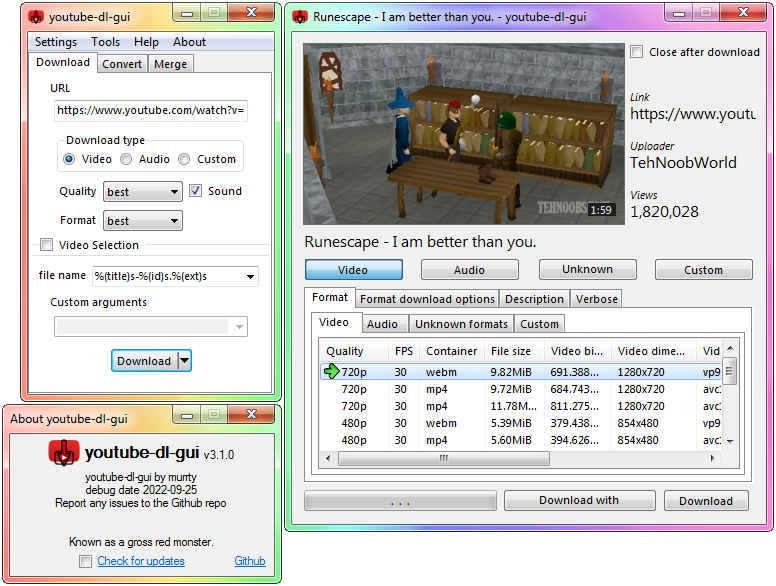

# youtube-dl-gui

GUI for [yt-dlp](https://github.com/yt-dlp/yt-dlp) ([youtube-dl](https://github.com/ytdl-org/youtube-dl) and [yt-dlc](https://github.com/blackjack4494/yt-dlc) are supported, but yt-dlp is suggested) + [ffmpeg](https://ffmpeg.org/) (ffmpeg.exe & ffprobe.exe) which is used for converting. [AtomicParsley](http://atomicparsley.sourceforge.net/) may be required for embedding data into files.

  
<sup>it may look different between versions, additionally, the download form in the screenshot is the extended download form.</sup>

The goal of youtube-dl-gui is to make it as accessible to as many people as possible, with as many arguments added as options as I use them... or get requested to add them. If at all.

Powerusers can use the custom arguments option to have almost absolute control of the input arguments, excepting the URL and the output.

Additionally, [userscripts](USERSCRIPTS.md) can be used in conjunction with this program to extend functionality.

## Table of contents · Оглавление

Оглавление ведёт на **автоматические якоря заголовков** (как у **GitHub** и предпросмотра **Cursor/VS Code**): это slug из текста `##` / `###` / `#`, без ручного HTML. Ссылки — **`#slug`** (без `README.md`), чтобы в **предпросмотре** (Ctrl+Shift+V) открывалась прокрутка **в этом же превью**, а не попытка открыть путь к файлу (на Windows и в multi-root это даёт «Unable to open»). Повторяющийся заголовок **Linux** во второй раз получает суффикс **`linux-1`**. В **исходнике** удобна панель **Outline**.

**English**

- [Quick command cheat sheet (Desktop / scripts)](#quick-command-cheat-sheet-windows)
- [Prerequisites](#prerequisites)
- [First run (Windows)](#first-run-windows)
- [Usage](#usage)
  - [Quick downloader](#quick-downloader)
  - [Extended downloader](#extended-downloader)
- [Project backup (Python)](#project-backup-python)
- [Custom Arguments](#custom-arguments)
- [Compatible sites](#compatible-sites)
- [Compiling](#compiling)
- [Dependencies](#dependencies)
  - [Linux](#linux)
- [Contributing](#contributing)
- [What is that hyphen in the version number?](#what-is-that-hyphen-in-the-version-number)

**Русский**

- [Все команды — шпаргалка (рабочий стол / скрипты)](#все-команды--шпаргалка-windows)
- [youtube-dl-gui — русский](#youtube-dl-gui--русский)
- [Требования](#требования)
- [Первый запуск (Windows)](#первый-запуск-windows)
- [Использование](#использование)
  - [Быстрая загрузка](#быстрая-загрузка)
  - [Расширенная загрузка](#расширенная-загрузка)
- [Бекап проекта (Python)](#бекап-проекта-python)
- [Произвольные аргументы](#произвольные-аргументы)
- [Поддерживаемые сайты](#поддерживаемые-сайты)
- [Сборка](#сборка)
- [Зависимости](#зависимости)
  - [Linux](#linux-1)
- [Участие в проекте](#участие-в-проекте)
- [Что значит дефис в номере версии?](#что-значит-дефис-в-номере-версии)

## Quick command cheat sheet (Windows)

Use **PowerShell**. First go to the **repository root** (folder that contains `youtube-dl-gui.sln`, `build.ps1`, `create-desktop-shortcut.ps1`, `backup_project.py`). Replace the path with yours if different.

```powershell
cd C:\Python\PythonProject\GigaChat\youtube-dl-gui-master
```

**Important — build vs Desktop:** You do **not** compile “on the Desktop.” **Building** always runs **in the project folder** (below) via `build.ps1` or Visual Studio. The compiled program is written to **`youtube-dl-gui\bin\Release\youtube-dl-gui.exe`** (or `\Debug\`) **inside the repo**, not on the Desktop. **`create-desktop-shortcut.ps1` only creates a shortcut** (`youtube-dl-gui.lnk`) on the Desktop so you can **launch** the app with a double-click — it does not perform the build and does not copy the whole project to the Desktop.

### Step-by-step: build and create the Desktop shortcut

1. **One-time:** Install [Visual Studio](https://visualstudio.microsoft.com/) or **Build Tools for Visual Studio** with **.NET desktop development** and **.NET Framework 4.7.2** targeting — see [Prerequisites](#prerequisites).
2. Open **PowerShell** (Start menu → type `PowerShell` → **Windows PowerShell**).
3. Switch to the **repository root** (folder that contains `build.ps1` and `youtube-dl-gui.sln`). Replace the path with yours:
   ```powershell
   cd C:\Python\PythonProject\GigaChat\youtube-dl-gui-master
   ```
4. **Build** (creates `youtube-dl-gui.exe` under `youtube-dl-gui\bin\Release`):
   ```powershell
   powershell -ExecutionPolicy Bypass -File .\build.ps1
   ```
   Wait for **`Build OK:`** and a line showing the path to `youtube-dl-gui.exe`. If it fails, fix the Visual Studio / Build Tools installation first.
5. **Create the shortcut** on your Desktop and copy language files next to the exe. If you build **Debug** in Visual Studio (output in `bin\Debug`), use:
   ```powershell
   powershell -ExecutionPolicy Bypass -File .\create-desktop-shortcut.ps1 -PreferDebug
   ```
   If you use **Release** (or have both), you can use the same line **without** `-PreferDebug`, or explicitly:
   ```powershell
   powershell -ExecutionPolicy Bypass -File .\create-desktop-shortcut.ps1
   ```
   You should see **`Shortcut:`** … `\Desktop\youtube-dl-gui.lnk` and a line about **Languages** / `lang`.
6. **Start the app:** go to your **Desktop** and double-click **`youtube-dl-gui.lnk`**.

**Alternative for step 4:** open `youtube-dl-gui.sln` in Visual Studio, choose **Release**, then **Build → Build Solution** (Ctrl+Shift+B). Then run **step 5** from PowerShell in the repo root (the shortcut script still expects the built exe in `bin\Release` or `bin\Debug`).

| What | Command |
|------|---------|
| **Build** the GUI (Release, no Visual Studio window) | `powershell -ExecutionPolicy Bypass -File .\build.ps1` |
| **Build** Debug | `powershell -ExecutionPolicy Bypass -File .\build.ps1 -Configuration Debug` |
| **Desktop shortcut** for `youtube-dl-gui.exe` + copy `Languages` → `lang` | `powershell -ExecutionPolicy Bypass -File .\create-desktop-shortcut.ps1` |
| Shortcut, prefer **Debug** exe | `powershell -ExecutionPolicy Bypass -File .\create-desktop-shortcut.ps1 -PreferDebug` |
| Shortcut to a **custom** exe path | `powershell -ExecutionPolicy Bypass -File .\create-desktop-shortcut.ps1 -ExePath "D:\path\youtube-dl-gui.exe"` |
| **ZIP backup** of the project (Python 3.10+) | `python backup_project.py` or `py backup_project.py` |

**Typical flow:** `cd` → `build.ps1` → `create-desktop-shortcut.ps1` → launch **youtube-dl-gui** from the Desktop. **Ctrl+C** while zipping cancels `backup_project.py`.

**Desktop shortcut → Debug build (Visual Studio default):** from the repo root, copy-paste:

```powershell
powershell -ExecutionPolicy Bypass -File .\create-desktop-shortcut.ps1 -PreferDebug
```

Use this when you only compile **Debug** (`bin\Debug\youtube-dl-gui.exe`); without `-PreferDebug`, the script prefers **Release** first.

**Run any script from another folder** (full paths):

```powershell
powershell -ExecutionPolicy Bypass -File "C:\Python\PythonProject\GigaChat\youtube-dl-gui-master\build.ps1"
powershell -ExecutionPolicy Bypass -File "C:\Python\PythonProject\GigaChat\youtube-dl-gui-master\create-desktop-shortcut.ps1"
powershell -ExecutionPolicy Bypass -File "C:\Python\PythonProject\GigaChat\youtube-dl-gui-master\create-desktop-shortcut.ps1" -PreferDebug
py "C:\Python\PythonProject\GigaChat\youtube-dl-gui-master\backup_project.py"
```

### `build.ps1` vs `create-desktop-shortcut.ps1`

| | **`build.ps1`** | **`create-desktop-shortcut.ps1`** |
|---|-----------------|-----------------------------------|
| **Purpose** | **Compiles** the C# solution (`youtube-dl-gui.sln`) with **MSBuild** and writes `youtube-dl-gui.exe` under `youtube-dl-gui\bin\Release` or `\Debug`. | **Does not compile.** Expects an **already built** exe; creates convenience only. |
| **Needs** | Visual Studio 2022 (or **Build Tools**) with **.NET desktop** workload and **.NET Framework 4.7.2** targeting — same idea as building from the IDE. | A reachable `youtube-dl-gui.exe` (by default looks under `bin\Release`, then `bin\Debug`; or pass `-ExePath` / `-PreferDebug`). |
| **What it does** | Runs `MSBuild.exe` on the solution (`-Configuration Release` or `Debug`). | Puts **`youtube-dl-gui.lnk`** on your **Desktop**, sets **Start in** to the exe’s folder (correct for dropping `yt-dlp` / **ffmpeg** next to the app), and copies **`Languages\*.ini`** → **`lang\`** next to that exe so extra languages appear in the app. |

**Typical order:** `build.ps1` when you need a fresh binary; `create-desktop-shortcut.ps1` when you want a desktop shortcut and `lang` files beside the exe (again after adding languages, re-run the shortcut script).

## Prerequisites

A Windows computer (or any computer) that has support for the **[.NET Framework 4.7.2 runtime](https://dotnet.microsoft.com/en-us/download/dotnet-framework/net472)**.

Youtube-dl (or any fork) may require ffmpeg to be present along side it.


## First run (Windows)

This is for the **youtube-dl-gui** program (`youtube-dl-gui.exe`), not the Python [project backup](#project-backup-python) script.

The subsections below are the **Visual Studio + File Explorer** path: open the `.sln`, build from menus, run the exe or create a shortcut with the Windows wizard. For the **PowerShell** path (`build.ps1`, `create-desktop-shortcut.ps1`), use the [Quick command cheat sheet](#quick-command-cheat-sheet-windows) at the top of this README.

### Build and run from this repo

1. Install [Visual Studio](https://visualstudio.microsoft.com/) (or **Build Tools for Visual Studio**) with the **.NET desktop development** workload and **.NET Framework 4.7.2** targeting pack / developer pack.
2. Open `youtube-dl-gui.sln` in the repository root.
3. Set configuration to **Release** (toolbar), then **Build → Build Solution** (Ctrl+Shift+B).
4. Start the app:
   - from **File Explorer**: open  
     `youtube-dl-gui\bin\Release\youtube-dl-gui.exe`  
     (for **Debug** builds use `bin\Debug\` instead), or  
   - from Visual Studio: **Debug → Start Without Debugging** (Ctrl+F5) after choosing the `youtube-dl-gui` startup project.

### Desktop shortcut (optional)

**Manual shortcut:** Windows’ **New → Shortcut** wizard (you type the path to `youtube-dl-gui.exe` and set **Start in** yourself). **Easier:** use `create-desktop-shortcut.ps1` from the cheat sheet — it sets **Start in** correctly and copies `Languages` → `lang`.

1. Desktop → right-click → **New** → **Shortcut**.
2. **Target** (example — use your real path):

   `"C:\Python\PythonProject\GigaChat\youtube-dl-gui-master\youtube-dl-gui\bin\Release\youtube-dl-gui.exe"`

3. **Start in:** the folder that contains that `.exe` (e.g. `...\bin\Release\`). Keeping **Start in** equal to the exe folder makes it easy to drop `yt-dlp.exe` / `ffmpeg` next to the program; see [Usage](#usage).

**Or use the script** `create-desktop-shortcut.ps1` in the repo root (creates `youtube-dl-gui.lnk` on your Desktop, **Start in** = folder of the exe). From the repo folder in PowerShell:

```text
powershell -ExecutionPolicy Bypass -File .\create-desktop-shortcut.ps1
```

Uses **Release** `youtube-dl-gui.exe` if it exists, otherwise **Debug**. For a custom location:  
`powershell -ExecutionPolicy Bypass -File .\create-desktop-shortcut.ps1 -ExePath "D:\path\to\youtube-dl-gui.exe"`

The script also copies `Languages\*.ini` from the repo into `lang\` next to the exe (the app only lists languages if that folder exists). Re-run the script after adding language files if needed.

### Prebuilt release

If you use a packaged release from the maintainer, extract it, run `youtube-dl-gui.exe` from that folder, and use the same shortcut rules (**Start in** = folder of the exe).

**First launch:** read the dialogs. If yt-dlp/youtube-dl is missing, the app may offer to download it.


## Usage

**On first start, be sure to read the dialogs.**

This program won't run without youtube-dl being in either the same directory as youtube-dl-gui, or in the system's PATH. It's designed to download youtube-dl for you if it does not find one.

If you want to use a schema, feel free to build your own using [the following useable replacement flags](https://github.com/ytdl-org/youtube-dl/blob/master/README.md#output-template) (perhaps i'll add a friendly way of building your own), or just stick to one of the default ones.

Downloading with custom formats and converting in any way will require FFmpeg, which you can download and put the files in "ffmpeg/bin/*.exe" in with the same directory as youtube-dl-gui or extract it anywhere and put the bin directory into your windows PATH.

The static paths for youtube-dl and ffmpeg may be set, which will allow you to select the executable, for youtube-dl, and/or the directory, for ffmpeg.

There are 2 ways to download media; the quick downloader and the extended downloader.


### Quick downloader

This is the original download form, and while doesn't provide specific formats to choose from, it relies on the main forms (or saved settings) to gather requested formats. It lays all the hard work onto youtube-dl to figure out the best formats for you. This is the only form that supports mass downloading (playlist, channel, etc) due to its' agnostic approach to formats and qualities.


### Extended downloader

This form gives you more information about the media you requested, such as all available formats, and any unknown formats that can additionally be downloaded. It also supports custom arguments, but if that is your choice of download, it'd be faster to use the quick downloader. It does not support mass downloading (playlist, channel, etc) and most likely will not work in that way.


## Project backup (Python)

The repository includes `backup_project.py` — a small script that zips the project (excluding `venv`, `bin`/`obj`, downloads, secrets, etc.). Archives are written to the `backups/` folder inside the project; only the three newest ZIP files are kept.

**Requirements:** [Python](https://www.python.org/downloads/) **3.10+** on PATH (the script uses `Path | None` typing).

**Run from the project folder (normal way)**

1. Open **PowerShell** or **Command Prompt**.
2. Go to the folder that contains `backup_project.py`, for example:
   - `cd C:\Python\PythonProject\GigaChat\youtube-dl-gui-master`
3. Run:
   - `python backup_project.py`  
   - or on Windows: `py backup_project.py`

**Shortcut on the Desktop (optional)**

1. Right-click the Desktop → **New** → **Shortcut**.
2. **Target** (example — adjust paths to your PC):

   `py "C:\Python\PythonProject\GigaChat\youtube-dl-gui-master\backup_project.py"`

   If `py` is not found, use the full path to `python.exe`, e.g.  
   `"C:\Users\YourName\AppData\Local\Programs\Python\Python312\python.exe" "C:\...\youtube-dl-gui-master\backup_project.py"`

3. **Start in:** set to the same folder as the project, e.g.  
   `C:\Python\PythonProject\GigaChat\youtube-dl-gui-master`

4. Finish the wizard and double-click the shortcut to create a backup.

During zipping, **Ctrl+C** cancels the job and deletes an incomplete archive (exit code 130).


## Custom Arguments

When using custom arguments, the url and save directory are automatically passed, url being the first thing passed, followed by custom arguments, and the save-to directory being the final one passed.

Examples:  
`youtube-dl.exe https://awebsite.tld/video.html \<custom arguments> -o "C:\Users\User\Downloads\"`  
`ffmpeg.exe -i "C:\Users\User\Downloads\VideoToConvert.ext" \<custom arguments> "C:\Users\User\Downloads\FileOutput.ext"`

Additionally, if you do include custom arguments on non-custom downloads, they will be appended to the end of the generated arguments, so you can use custom arguments along the generated arguments.


## Compatible sites

Each fork may have differences in compatible sites. It's recommended to do your own research. Or just try it, and see if it works. The worst that can happen is you blow up.


## Compiling

The project is built with any compiler that supports using C# 11 (Preview), .NET Framework 4.7.2, and WinForms.

The `Debug` configuration may disable certain actions from working. But it's the debug config, what do you expect?

**Command-line build (no Visual Studio IDE):** install [Build Tools for Visual Studio 2022](https://visualstudio.microsoft.com/downloads/) with **.NET desktop build tools** and .NET Framework 4.7.2 targeting, then from the repo root:

```text
powershell -ExecutionPolicy Bypass -File .\build.ps1
```

Debug build: `.\build.ps1 -Configuration Debug`. The script locates `MSBuild.exe` via `vswhere` or common install paths. After a successful build, run `.\create-desktop-shortcut.ps1` if you want a Desktop shortcut and `lang` files copied next to the exe.


## Dependencies

This project aims to be as independant as possible, losing functionaity in favor of portability, but functions that can be replaced with internal functions have and will be replaced.


### Linux

This project isn't targetting users who run Linux or GNU. It may be possible to run using Wine or Mono, but I wouldn't hold my breath.


## Contributing

For anyone looking to translate, feel free to open a pull request with the new language file in the `Language` folder. Check if a language you're translating exists already, and you can edit it off of that.

For anyone looking to contribute to the code, make a pull request with the changed code.

Finally, contributions to the project through alternative means, like `Userscripts` or browser extensions to increase functionality of using the program are welcome through pull requests for review & merge. You can create a pull-request to add a link to your user-script by editing the [userscripts markdown file](USERSCRIPTS.md) and adding your userscript(s), your username, and the sites supported to the main grid.


## What is that hyphen in the version number?

It deontes that the version is a preview version (internally called a beta version).

Something marked as `1.0.0` is not a preview version, but `1.0.1-1` is a preview version. Similarly, `1.0.1` is NOT a preview version because there's no hypened number appended to it.

---


# youtube-dl-gui — русский

Графический интерфейс для [yt-dlp](https://github.com/yt-dlp/yt-dlp) (поддерживаются и [youtube-dl](https://github.com/ytdl-org/youtube-dl), и [yt-dlc](https://github.com/blackjack4494/yt-dlc), но рекомендуется yt-dlp) и [ffmpeg](https://ffmpeg.org/) (ffmpeg.exe и ffprobe.exe) для конвертации. Для встраивания метаданных в файлы может понадобиться [AtomicParsley](http://atomicparsley.sourceforge.net/).

  
<sup>Внешний вид может отличаться в разных версиях; на скриншоте — расширенная форма загрузки.</sup>

Цель youtube-dl-gui — сделать загрузку доступной для как можно большего числа людей и вынести в настройки те аргументы, которыми пользуюсь я… или которые просят добавить. По возможности.

Опытные пользователи могут использовать произвольные аргументы и почти полностью контролировать параметры запуска, кроме URL и каталога сохранения.

Дополнительно можно использовать [userscripts](USERSCRIPTS.md) вместе с программой.

## Все команды — шпаргалка (Windows)

Нужны **PowerShell** и переход в **корень репозитория** (папка, где лежат `youtube-dl-gui.sln`, `build.ps1`, `create-desktop-shortcut.ps1`, `backup_project.py`). Путь ниже замените на свой.

```powershell
cd C:\Python\PythonProject\GigaChat\youtube-dl-gui-master
```

**Важно — сборка и рабочий стол:** Сборку **нельзя сделать «на рабочем столе»**. Она всегда выполняется **в папке проекта** (ниже): `build.ps1` или Visual Studio. Готовый файл попадает в **`youtube-dl-gui\bin\Release\youtube-dl-gui.exe`** (или в `\Debug\`) **внутри репозитория**, а не на рабочий стол. Скрипт **`create-desktop-shortcut.ps1` только создаёт ярлык** (`youtube-dl-gui.lnk`) на рабочем столе, чтобы **запускать** программу двойным щелчком — он **не собирает** проект и **не копирует** весь проект на рабочий стол.

### Пошагово: собрать программу и создать ярлык на рабочем столе

1. **Один раз:** установите [Visual Studio](https://visualstudio.microsoft.com/) или **Build Tools for Visual Studio** с рабочей нагрузкой **Разработка классических приложений .NET** и компонентом **.NET Framework 4.7.2** (targeting pack) — см. [Требования](#требования).
2. Откройте **PowerShell** (Пуск → введите `PowerShell` → **Windows PowerShell**).
3. Перейдите в **корень репозитория** (папка, где лежат `build.ps1` и `youtube-dl-gui.sln`). Путь замените на свой:
   ```powershell
   cd C:\Python\PythonProject\GigaChat\youtube-dl-gui-master
   ```
4. **Сборка** (появится `youtube-dl-gui.exe` в `youtube-dl-gui\bin\Release`):
   ```powershell
   powershell -ExecutionPolicy Bypass -File .\build.ps1
   ```
   Дождитесь строки **`Build OK:`** и пути к `youtube-dl-gui.exe`. Если ошибка — сначала исправьте установку Visual Studio / Build Tools.
5. **Ярлык на рабочем столе** и копирование языков рядом с exe. Если в Visual Studio собираете **Debug** (выход в `bin\Debug`), выполните:
   ```powershell
   powershell -ExecutionPolicy Bypass -File .\create-desktop-shortcut.ps1 -PreferDebug
   ```
   Для **Release** (или если есть оба варианта) можно без `-PreferDebug`:
   ```powershell
   powershell -ExecutionPolicy Bypass -File .\create-desktop-shortcut.ps1
   ```
   В выводе должны быть **`Shortcut:`** … `\Desktop\youtube-dl-gui.lnk` и строка про **Languages** / `lang`.
6. **Запуск:** откройте **рабочий стол** и дважды щёлкните **`youtube-dl-gui.lnk`**.

**Вместо шага 4:** откройте `youtube-dl-gui.sln` в Visual Studio, выберите **Release**, затем **Сборка → Собрать решение** (Ctrl+Shift+B). После этого всё равно выполните **шаг 5** из PowerShell в корне репозитория (скрипт ярлыка ищет exe в `bin\Release` или `bin\Debug`).

| Задача | Команда |
|--------|---------|
| **Сборка** программы (Release, без окна Visual Studio) | `powershell -ExecutionPolicy Bypass -File .\build.ps1` |
| **Сборка** Debug | `powershell -ExecutionPolicy Bypass -File .\build.ps1 -Configuration Debug` |
| **Ярлык на рабочем столе** для `youtube-dl-gui.exe` + копирование `Languages` → `lang` | `powershell -ExecutionPolicy Bypass -File .\create-desktop-shortcut.ps1` |
| Ярлык, если нужен именно **Debug**-exe | `powershell -ExecutionPolicy Bypass -File .\create-desktop-shortcut.ps1 -PreferDebug` |
| Ярлык на **свой** путь к exe | `powershell -ExecutionPolicy Bypass -File .\create-desktop-shortcut.ps1 -ExePath "D:\путь\youtube-dl-gui.exe"` |
| **Бекап проекта** в ZIP (Python 3.10+) | `python backup_project.py` или `py backup_project.py` |

**Обычный порядок:** `cd` → `build.ps1` → `create-desktop-shortcut.ps1` → запуск **youtube-dl-gui** с рабочего стола. Во время ZIP-бекапа **Ctrl+C** отменяет `backup_project.py`.

**Ярлык на рабочем столе → сборка Debug (как в Visual Studio по умолчанию):** из корня репозитория скопируйте команду:

```powershell
powershell -ExecutionPolicy Bypass -File .\create-desktop-shortcut.ps1 -PreferDebug
```

Без `-PreferDebug` скрипт сначала ищет **Release**; эта строка нужна, если вы собираете только **Debug** (`bin\Debug\youtube-dl-gui.exe`).

**Запуск из любой папки** (полные пути):

```powershell
powershell -ExecutionPolicy Bypass -File "C:\Python\PythonProject\GigaChat\youtube-dl-gui-master\build.ps1"
powershell -ExecutionPolicy Bypass -File "C:\Python\PythonProject\GigaChat\youtube-dl-gui-master\create-desktop-shortcut.ps1"
powershell -ExecutionPolicy Bypass -File "C:\Python\PythonProject\GigaChat\youtube-dl-gui-master\create-desktop-shortcut.ps1" -PreferDebug
py "C:\Python\PythonProject\GigaChat\youtube-dl-gui-master\backup_project.py"
```

### `build.ps1` и `create-desktop-shortcut.ps1` — в чём разница

| | **`build.ps1`** | **`create-desktop-shortcut.ps1`** |
|---|-----------------|-----------------------------------|
| **Назначение** | **Собирает** проект на C#: запускает **MSBuild** для `youtube-dl-gui.sln` и кладёт `youtube-dl-gui.exe` в `youtube-dl-gui\bin\Release` или `\Debug`. | **Не собирает** проект. Рассчитан на то, что **exe уже есть**; делает удобства для запуска. |
| **Что нужно** | Visual Studio 2022 (или **Build Tools**) с рабочей нагрузкой **.NET desktop** и **.NET Framework 4.7.2** — по сути то же, что сборка из IDE. | Доступный `youtube-dl-gui.exe` (по умолчанию ищет в `bin\Release`, затем `bin\Debug`; можно `-ExePath` / `-PreferDebug`). |
| **Действие** | Вызывает `MSBuild.exe` для решения (`-Configuration Release` или `Debug`). | Создаёт на **рабочем столе** ярлык **`youtube-dl-gui.lnk`**, выставляет **рабочую папку** = каталог с exe (удобно класть рядом `yt-dlp` и **ffmpeg**), копирует **`Languages\*.ini`** в **`lang\`** рядом с этим exe, чтобы в программе были языки кроме встроенного English. |

**Обычный порядок:** сначала `build.ps1`, когда нужна новая сборка; затем `create-desktop-shortcut.ps1`, когда нужен ярлык и папка `lang` рядом с exe (после добавления языков скрипт ярлыка стоит запустить снова).


## Требования

Компьютер с Windows (или другой ОС) с установленной **[средой выполнения .NET Framework 4.7.2](https://dotnet.microsoft.com/en-us/download/dotnet-framework/net472)**.

Рядом с youtube-dl (или форком) часто нужен ffmpeg.


## Первый запуск (Windows)

Речь о **программе youtube-dl-gui** (`youtube-dl-gui.exe`), а не о Python-скрипте [бекапа проекта](#бекап-проекта-python).

Ниже — путь **через Visual Studio и Проводник**: открыть `.sln`, собрать из меню, запустить exe или сделать ярлык **вручную** мастером Windows. Вариант из **PowerShell** (`build.ps1`, `create-desktop-shortcut.ps1`) и пошаговая инструкция — в [шпаргалке команд](#все-команды--шпаргалка-windows) в начале README.

### Сборка и запуск из этого репозитория

1. Установите [Visual Studio](https://visualstudio.microsoft.com/) (или **Build Tools for Visual Studio**) с рабочей нагрузкой **Разработка классических приложений .NET** и компонентом **.NET Framework 4.7.2** (targeting pack / developer pack).
2. Откройте в корне репозитория файл `youtube-dl-gui.sln`.
3. В панели инструментов выберите конфигурацию **Release**, затем **Сборка → Собрать решение** (Ctrl+Shift+B).
4. Запуск:
   - через **Проводник**: откройте  
     `youtube-dl-gui\bin\Release\youtube-dl-gui.exe`  
     (для отладочной сборки — `bin\Debug\`), или  
   - из Visual Studio: **Отладка → Запуск без отладки** (Ctrl+F5), если стартовым проектом выбран `youtube-dl-gui`.

### Ярлык на рабочем столе (по желанию)

**Вручную:** мастер Windows (**Создать → Ярлык**) — вы сами указываете путь к `youtube-dl-gui.exe` и **рабочую папку**. **Проще:** скрипт `create-desktop-shortcut.ps1` из шпаргалки — сам выставит «Начать в» и скопирует `Languages` → `lang`.

1. Рабочий стол → ПКМ → **Создать** → **Ярлык**.
2. **Объект** (подставьте свой путь):

   `"C:\Python\PythonProject\GigaChat\youtube-dl-gui-master\youtube-dl-gui\bin\Release\youtube-dl-gui.exe"`

3. **Рабочая папка:** каталог, где лежит этот `.exe` (например `...\bin\Release\`). Так проще положить рядом `yt-dlp.exe` и **ffmpeg**; подробности — в [Использование](#использование).

**Или скриптом:** в корне репозитория лежит `create-desktop-shortcut.ps1` — создаёт на рабочем столе ярлык `youtube-dl-gui.lnk` с правильной **рабочей папкой**. В PowerShell из каталога проекта:

```text
powershell -ExecutionPolicy Bypass -File .\create-desktop-shortcut.ps1
```

Берётся **Release**-сборка, если есть, иначе **Debug**. Свой путь к exe:  
`powershell -ExecutionPolicy Bypass -File .\create-desktop-shortcut.ps1 -ExePath "D:\путь\youtube-dl-gui.exe"`

Скрипт копирует из репозитория папку **`Languages`** в **`lang`** рядом с exe — без этого в окне выбора языка будет только **English (Internal)**. Если языков нет, запустите скрипт ещё раз (или скопируйте `*.ini` в `...\bin\Release\lang\` вручную).

### Готовая сборка (релиз)

Если вы скачали готовый архив от автора проекта, распакуйте его, запускайте `youtube-dl-gui.exe` из этой папки; ярлык создавайте так же (**Рабочая папка** = папка с exe).

**Первый запуск:** прочитайте диалоги. Если нет yt-dlp/youtube-dl, программа может предложить скачать его.


## Использование

**При первом запуске обязательно прочитайте диалоги.**

Программа не запустится без youtube-dl в той же папке, что и youtube-dl-gui, или в **PATH**. Если исполняемый файл не найден, программа может скачать youtube-dl за вас.

Шаблоны имён файлов можно строить по [подстановочным флагам youtube-dl](https://github.com/ytdl-org/youtube-dl/blob/master/README.md#output-template) (возможно, позже появится более удобный редактор), либо использовать встроенные шаблоны.

Произвольные форматы и конвертация требуют FFmpeg: положите `ffmpeg/bin/*.exe` рядом с youtube-dl-gui или добавьте каталог `bin` ffmpeg в **PATH** Windows.

Можно задать постоянные пути к youtube-dl (исполняемый файл) и к ffmpeg (каталог).

Есть два режима загрузки: быстрая и расширенная форма.


### Быстрая загрузка

Исходная форма: без выбора конкретных форматов на этой вкладке — параметры берутся из главных настроек. Выбор формата оставлен youtube-dl. Именно эта форма поддерживает массовую загрузку (плейлист, канал и т.д.).


### Расширенная загрузка

Показывает больше информации о медиа и доступных форматах, в том числе нестандартных. Есть произвольные аргументы; если вам нужен только кастомный вызов, быстрее может быть быстрая форма. Массовая загрузка (плейлисты и т.п.) здесь не поддерживается и с большой вероятностью не сработает.


## Бекап проекта (Python)

В репозитории есть `backup_project.py` — скрипт, который упаковывает проект в ZIP (исключаются `venv`, `bin`/`obj`, скачанные видео, секреты и т.д.). Архивы пишутся в папку `backups/` внутри проекта; хранятся не более трёх последних ZIP.

**Нужно:** [Python](https://www.python.org/downloads/) **3.10+** в **PATH**.

**Запуск из папки проекта (обычный способ)**

1. Откройте **PowerShell** или **«Командная строка»**.
2. Перейдите в каталог, где лежит `backup_project.py`, например:  
   `cd C:\Python\PythonProject\GigaChat\youtube-dl-gui-master`
3. Выполните:  
   `python backup_project.py`  
   или в Windows:  
   `py backup_project.py`

**Ярлык на рабочем столе (по желанию)**

1. ПКМ по рабочему столу → **Создать** → **Ярлык**.
2. **Объект** (подставьте свои пути):

   `py "C:\Python\PythonProject\GigaChat\youtube-dl-gui-master\backup_project.py"`

   Если команды `py` нет, укажите полный путь к `python.exe`, например:  
   `"C:\Users\ВашеИмя\AppData\Local\Programs\Python\Python312\python.exe" "C:\...\youtube-dl-gui-master\backup_project.py"`

3. **Рабочая папка:** та же, что и проект, например:  
   `C:\Python\PythonProject\GigaChat\youtube-dl-gui-master`

4. Завершите мастер и запускайте бекап двойным щелчком по ярлыку.

Во время упаковки **Ctrl+C** прерывает работу и удаляет незавершённый архив (код выхода 130).


## Произвольные аргументы

При использовании кастомных аргументов URL и каталог сохранения подставляются автоматически: сначала URL, затем ваши аргументы, в конце — каталог назначения.

Примеры:  
`youtube-dl.exe https://awebsite.tld/video.html \<ваши аргументы> -o "C:\Users\User\Downloads\"`  
`ffmpeg.exe -i "C:\Users\User\Downloads\VideoToConvert.ext" \<ваши аргументы> "C:\Users\User\Downloads\FileOutput.ext"`

Если указать дополнительные аргументы и для обычной загрузки, они добавятся в конец сформированной командной строки.


## Поддерживаемые сайты

У разных форков список сайтов может отличаться. Лучше проверить документацию или просто попробовать.


## Сборка

Проект собирается компилятором с поддержкой C# 11 (Preview), .NET Framework 4.7.2 и WinForms.

В конфигурации **Debug** часть действий может быть отключена — это отладочная сборка.

**Сборка из командной строки (без окна Visual Studio):** установите [Build Tools for Visual Studio 2022](https://visualstudio.microsoft.com/downloads/) с рабочей нагрузкой **.NET desktop build tools** и компонентом **.NET Framework 4.7.2**, затем из корня репозитория:

```text
powershell -ExecutionPolicy Bypass -File .\build.ps1
```

Отладочная сборка: `.\build.ps1 -Configuration Debug`. Скрипт ищет `MSBuild.exe` через `vswhere` или типичные пути установки. После успешной сборки при необходимости запустите `.\create-desktop-shortcut.ps1` (ярлык и копирование `Languages` в `lang`).


## Зависимости

Проект старается быть автономным, иногда в ущерб функциям ради переносимости; то, что можно заменить встроенным кодом, со временем заменяется.


### Linux

Официально Linux не целевая платформа. Теоретически возможны Wine или Mono, но гарантий нет.


## Участие в проекте

Переводы — через pull request: файлы языков в папке `Language` (сначала проверьте, нет ли уже вашего языка).

Изменения кода — тоже через pull request.

Скрипты для браузера и прочие дополнения приветствуются; ссылки на userscript можно добавить в [USERSCRIPTS.md](USERSCRIPTS.md).


## Что значит дефис в номере версии?

Он означает предпросмотр (внутри — «бета»).

`1.0.0` — не предпросмотр; `1.0.1-1` — предпросмотр. `1.0.1` без суффикса через дефис — не предпросмотр.
